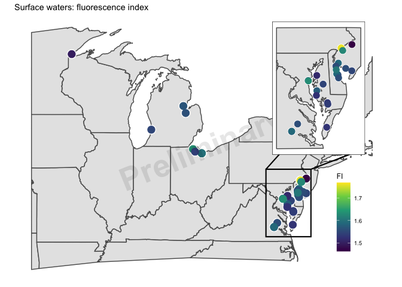
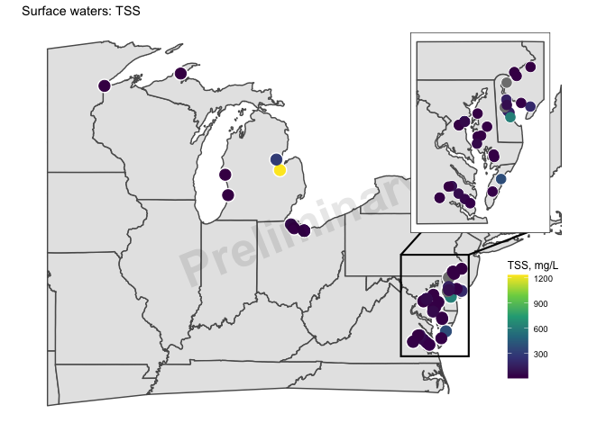
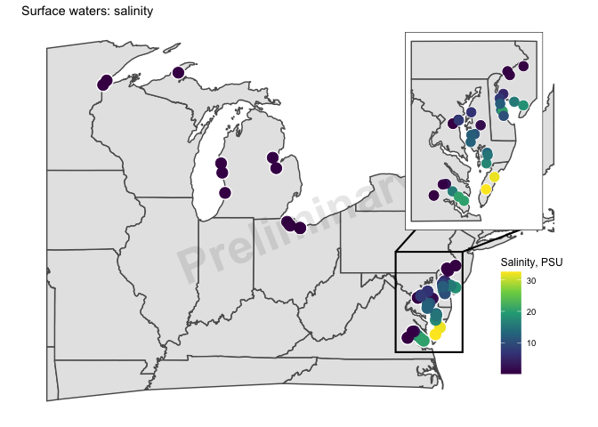

EXCHANGE Campign 1: Exploratory Figures
================

Date updated: 2022-06-07

------------------------------------------------------------------------

# Soils and sediments

## Soil: total C and N

<!-- --><!-- -->

<!-- --><!-- -->

------------------------------------------------------------------------

## Soil: pH and specific conductance

<!-- --><!-- -->

<!-- --><!-- -->

------------------------------------------------------------------------

## Soil: bulk density

<!-- -->

<!-- -->

------------------------------------------------------------------------

## Soil: gravimetric water content

<!-- -->

<!-- -->

------------------------------------------------------------------------

## Soil: loss on ignition

<!-- -->

<!-- -->

------------------------------------------------------------------------

------------------------------------------------------------------------

# Surface waters

## Water: Ions

<!-- -->

<!-- --><!-- --><!-- --><!-- -->

------------------------------------------------------------------------

## Water: CDOM Indices

<!-- -->

<!-- --><!-- -->

------------------------------------------------------------------------

## Water: Dissolved organic carbon and total dissolved nitrogen

DOC measured as NPOC (non-purgeable organic carbon)

<!-- --><!-- -->

<!-- -->

------------------------------------------------------------------------

## Water: Total suspended solids

<!-- -->

<!-- -->

------------------------------------------------------------------------

## Water: Water quality

<!-- -->

<!-- --><!-- -->

------------------------------------------------------------------------

------------------------------------------------------------------------

Session Info: Click to open

Date run: 2022-06-07

    #> R version 4.1.1 (2021-08-10)
    #> Platform: x86_64-apple-darwin17.0 (64-bit)
    #> Running under: macOS Catalina 10.15.7
    #> 
    #> Matrix products: default
    #> BLAS:   /Library/Frameworks/R.framework/Versions/4.1/Resources/lib/libRblas.0.dylib
    #> LAPACK: /Library/Frameworks/R.framework/Versions/4.1/Resources/lib/libRlapack.dylib
    #> 
    #> locale:
    #> [1] en_US.UTF-8/en_US.UTF-8/en_US.UTF-8/C/en_US.UTF-8/en_US.UTF-8
    #> 
    #> attached base packages:
    #> [1] stats     graphics  grDevices utils     datasets  methods   base     
    #> 
    #> other attached packages:
    #>  [1] ggthemes_4.2.4      googlesheets4_1.0.0 janitor_2.1.0      
    #>  [4] sf_1.0-7            cowplot_1.1.1       pacman_0.5.1       
    #>  [7] forcats_0.5.1       stringr_1.4.0       dplyr_1.0.9        
    #> [10] purrr_0.3.4         readr_2.1.2         tidyr_1.2.0        
    #> [13] tibble_3.1.5        ggplot2_3.3.6       tidyverse_1.3.1    
    #> 
    #> loaded via a namespace (and not attached):
    #>  [1] fs_1.5.2               lubridate_1.8.0        httr_1.4.2            
    #>  [4] tools_4.1.1            backports_1.2.1        utf8_1.2.2            
    #>  [7] R6_2.5.1               KernSmooth_2.23-20     DBI_1.1.1             
    #> [10] colorspace_2.0-2       withr_2.5.0            tidyselect_1.1.1      
    #> [13] gridExtra_2.3          curl_4.3.2             compiler_4.1.1        
    #> [16] cli_3.3.0              rvest_1.0.1            xml2_1.3.2            
    #> [19] officer_0.4.1          labeling_0.4.2         scales_1.1.1          
    #> [22] classInt_0.4-3         proxy_0.4-26           askpass_1.1           
    #> [25] rappdirs_0.3.3         systemfonts_1.0.4      digest_0.6.27         
    #> [28] rmarkdown_2.14         pkgconfig_2.0.3        htmltools_0.5.2       
    #> [31] dbplyr_2.1.1           fastmap_1.1.0          highr_0.9             
    #> [34] rvg_0.2.5              rlang_1.0.2            readxl_1.4.0          
    #> [37] rstudioapi_0.13        generics_0.1.0         farver_2.1.0          
    #> [40] jsonlite_1.7.2         zip_2.2.0              grattantheme_0.9.1.900
    #> [43] magrittr_2.0.3         s2_1.0.7               patchwork_1.1.1       
    #> [46] Rcpp_1.0.8             munsell_0.5.0          fansi_0.5.0           
    #> [49] gdtools_0.2.4          clipr_0.7.1            lifecycle_1.0.1       
    #> [52] stringi_1.7.6          yaml_2.2.1             snakecase_0.11.0      
    #> [55] grid_4.1.1             ggrepel_0.9.1          crayon_1.4.1          
    #> [58] haven_2.4.3            hms_1.1.0              knitr_1.39            
    #> [61] pillar_1.6.2           uuid_0.1-4             wk_0.6.0              
    #> [64] reprex_2.0.1           glue_1.6.2             evaluate_0.15         
    #> [67] modelr_0.1.8           vctrs_0.4.1            tzdb_0.1.2            
    #> [70] cellranger_1.1.0       gtable_0.3.0           openssl_1.4.4         
    #> [73] assertthat_0.2.1       xfun_0.31              openxlsx_4.2.5        
    #> [76] broom_0.8.0            e1071_1.7-8            class_7.3-19          
    #> [79] googledrive_2.0.0      viridisLite_0.4.0      gargle_1.2.0          
    #> [82] units_0.7-2            ellipsis_0.3.2
